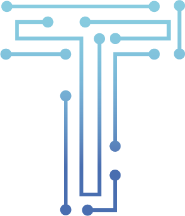

# Marchetti Boilerplate

[](https://snyk.io/test/github/thallesmarchetti/marchetti-boilerplate)
[](https://david-dm.org/thallesmarchetti/marchetti-boilerplate#info=devDependencies)

This is my first open source project, that provides me help to build a static website organized, standardized web apps with quality and agility.

## Requirements

Make sure you have all these dependencies installed before moving on:

- [Node.js](https://nodejs.org/en/)
- [NPM](https://www.npmjs.com/)
- [Yarn](https://yarnpkg.com/en/)
- [Gulp](https://gulpjs.com/)

## Instructions

```bash
1. Clone the project:
$ git clone https://github.com/thallesmarchetti/marchetti-boilerplate.git

2. Change directory to the cloned folder:
$ cd marchetti-boilerplate

3. Install required npm dependences:
$ npm install
or
$ yarn install

4. Build project for development:
$ gulp
```

Now the local dev is running at localhost:8080 :smile:

## Structure

The basic structure of the project is given in the following way:

```
│
├── build/
│   ├── css/
│   │   └── main.css
│   │   │
│   ├── images/
│   │   │
│   ├── js/
│   │   └── scripts.js
│   │
│   └── index.html
│
│
├── src/
│   │── templates/
│   │    │── includes/
│   │    │   ├── footer.html
│   │    │   ├── head.html
│   │    │   └── header.html
│   │    └── layout.html
│   │
│   │── styl/
│   │    └── main.styl
│   │
│   │── js/
│   │    └── scripts.js
│   │
│   │── images/
│   │
│   └── index.html
│
├── .editorconfig
├── .eslintrc
├── .gitignore
├── CONTRIBUTING.md
├── gulpfile.js
├── package.json
├── LICENSE.md
└── README.md
```

## Dependencies

Building a project requires a few dependencies, they are needed only during development and should not be installed on production. They will be installed along with your project dependencies when running  `yarn install` or `npm install`  command.

### Tasks

- `gulp`: run all tasks for development and initialize watch for changes and a server
- `gulp deploy`: run all tasks to build

### Yarn Scripts

- `yarn lint`: lint all files searching for errors, prepush and precommit.
- `yarn fix`: fix automaticaly some lint errors.

### NPM Scripts

- `npm run lint`: lint all files searching for errors, prepush and precommit.
- `npm run fix`: fix automaticaly some lint errors.

### Soon :soon:

I will introduce some automated tests.

### Contributing

Feel free to contribute and improve the project. See [CONTRIBUTING.md](CONTRIBUTING.md) for more information and how to get started.

### License

[MIT License](LICENSE.md) © [Thalles Marchetti](https://github.com/thallesmarchetti)

### Acknowledgments

Inspiration from some projects of my friend [willian_justen](https://github.com/willianjusten)
